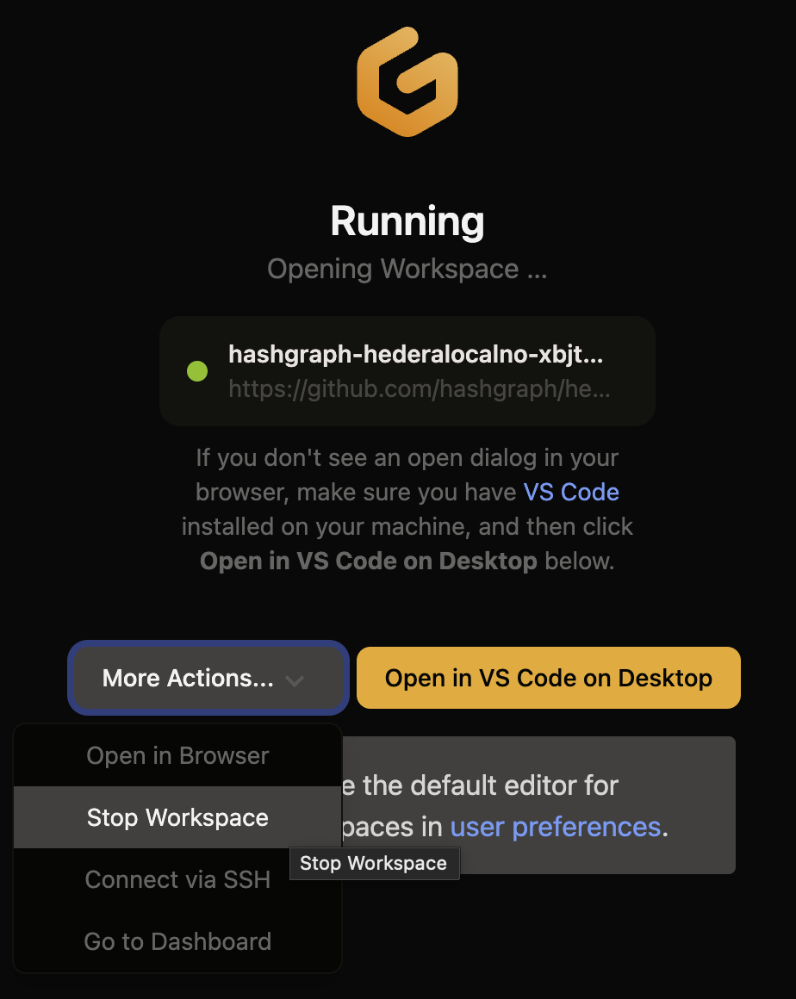

# Gitpod Setup Instructions

Gitpod provides Cloud Development Environments (CDEs),
and allows developer to work from any device without the need to maintain
static and brittle local development environments.

These instructions walk you through how to run `hedera-local-node`
via Gitpod.

## Before You Start

- Ensure that you have a Github account,
  and you are signed into in in your browser.
- If this is your first time using Gitpod, please read the
  [Gitpod getting started](https://www.gitpod.io/docs/introduction/getting-started) guide.
- The Mirror Node Web Explorer requires
  [VS Code Desktop](https://www.gitpod.io/docs/references/ides-and-editors/vscode)
  to be installed.

## Getting Started

### Login

Register a Gitpod account by logging with your GitLab/GitHub/Bitbucket account:
Gitpod Login](https://gitpod.io/login/)

### Check the billing information

Gitpod has both free and paid plans:
[Gitpod Pricing](https://www.gitpod.io/pricing)

### Set proper permissions

Enable `public_repo` permission for Github provider:
[Gitpod Git Providers](https://gitpod.io/user/integrations)


### Install Browser extension

Install the browser extension:
[Gitpod browser extension](https://www.gitpod.io/docs/configure/user-settings/browser-extension)

### IDEs & Editors

You can review the support for the popular IDE/editors:
[Gitpod IDEs & Editors](https://www.gitpod.io/docs/references/ides-and-editors)

For example, JetBrains and VS Code.

## Run Hedera Local Node

The `hedera-local-node` project already has a gitpod configuration,
which makes it easy to run it within a workspace on Gitpod.

### Open via Gitpod

Open the [Hedela Local Node repo](https://github.com/hashgraph/hedera-local-node).

Click on the Gitpod `Open` button.


The Gitpod browser extension modifies the Github UI to add this button.

This will run Gitpod workspace with CDE of your choice which runs the hedera local node.

You should see several dialogs requesting permissions to connect to the CDE,
from your IDE (e.g. within VS Code Desktop).

### Services

Various services are run wtihin `hedera-local-node`.
These are the endpoints for each service:

| Type                              | Endpoint                                         |
| --------------------------------- | ------------------------------------------------ |
| Consensus Node Endpoint           | [http://localhost:50211](http://localhost:50211) |
| Mirror Node GRPC Endpoint         | [http://localhost:5600](http://localhost:5600)   |
| Mirror Node REST API Endpoint     | [http://localhost:5551](http://localhost:5551)   |
| JSON RPC Relay Endpoint           | [http://localhost:7546](http://localhost:7546)   |
| JSON RPC Relay Websocket Endpoint | [http://localhost:8546](http://localhost:8546)   |
| Mirror Node Explorer (Hashscan)   | [http://localhost:8080/devnet/dashboard](http://localhost:8080/devnet/dashboard)   |
| Grafana UI                        | [http://localhost:3000](http://localhost:3000)   |
| Prometheus UI                     | [http://localhost:9090](http://localhost:9090)   |

You may access these services on `localhost`,
and these have redirects set up such that they are redirected through to the services
running on the gitpod workspace.

### Testing

#### Mirror Node REST API

The following command queries the Mirror Node for a list of accounts on your Hedera network.

```shell
curl "http://localhost:5551/api/v1/accounts" \
  -X GET
```

See the [Mirror Node interact API docs](https://testnet.mirrornode.hedera.com/api/v1/docs/)
for a full list of avalable APIs.

#### JSON RPC Relay

The following command queries the RPC Relay for the latest block on your Hedera network.

```shell
curl "http://localhost:7546" \
  -X POST \
  -H "Content-Type: application/json" \
  --data '{"method":"eth_getBlockByNumber","params":["latest",false],"id":1,"jsonrpc":"2.0"}'
```

See the [endpoint table](https://github.com/hashgraph/hedera-json-rpc-relay/blob/main/docs/rpc-api.md#endpoint-table)
in `hedera-json-rpc-relay` for a full list of available RPCs.

#### Mirror Node Explorer (Hashscan)

Simply visit the URL in your browser.

Esnure that `LOCALNET` is seelcted, as this will show you
the Hedera network running within your Gitpod,
and not one of the public nodes.

### Shut down the Gitpod workspace

Note that Gitpod usage is billed by the hour on paid plans,
and hours are limited on the free plans.
Therefore, once completed, do remember to stop the Gitpod workspace.



## Config file

`.gitpod.yml` is the configuration file for Gitpod:
[.gitpod.yml reference](https://www.gitpod.io/docs/references/gitpod-yml)

## Referenced Documents

* [Getting started](https://www.gitpod.io/docs/introduction/getting-started)
* [Learn Gitpod](https://www.gitpod.io/docs/introduction/learn-gitpod)
* [Browser & Desktop](https://www.gitpod.io/docs/introduction/learn-gitpod/browser-desktop)
* [Tasks](https://www.gitpod.io/docs/configure/workspaces/tasks)
* [Ports](https://www.gitpod.io/docs/configure/workspaces/ports)
* [Browser Extension](https://www.gitpod.io/docs/configure/user-settings/browser-extension)
* [.gitpod.yml](https://www.gitpod.io/docs/references/gitpod-yml)
* [IDEs & Editors](https://www.gitpod.io/docs/references/ides-and-editors)
* [Github Integration](https://www.gitpod.io/docs/integrations/github)
* [Plans and pricing](https://www.gitpod.io/pricing)
